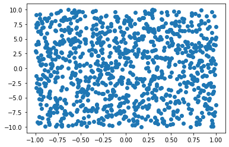

# Python Decorative Visualization Library

A concept for a visualization library:

```python
import numpy as np
import pandas as pd
from pydevil.decorators import scatter

data = pd.DataFrame({
    "x": np.random.uniform( -1,  1, 1000),
    "y": np.random.uniform(-10, 10, 1000),
})

@scatter
def get_x_y(data):
    return data['x'], data['y']

get_x_y(data)
```


